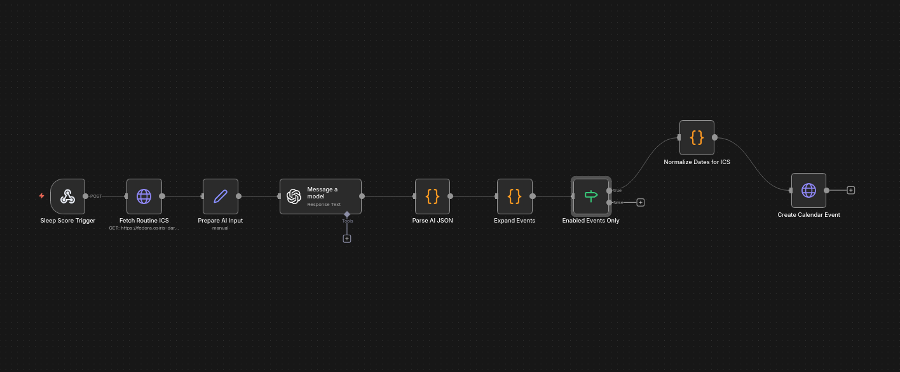
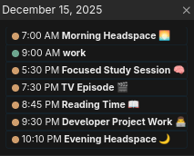

# 📅 AI Daily Scheduler — Intelligent Routine Planning with n8n & OpenAI

A real-world automation I built to dynamically plan my daily routine based on sleep quality, calendar constraints, and energy levels.

> Automatically generates a realistic, non-overlapping daily schedule — optimized for learning.

This n8n workflow uses OpenAI to analyze my calendar, sleep score, and personal constraints, then **creates a balanced daily routine** directly in my calendar.  
It’s designed for developers who study while working full-time and want structure without micromanagement.

---

## 🔧 Features at a Glance

- 🧠 **AI-generated daily routine** based on real constraints  
- 😴 **Sleep-aware planning** (adjusts intensity using sleep score)  
- 📆 **Calendar-aware** (never overlaps existing events)  
- 📚 **Study-first prioritization** with enforced learning blocks  
- ⏱️ **Dynamic Pomodoro timers** generated per study session  
- 🌙 **Morning & evening headspace** for mental hygiene  
- 🏠 Fully **self-hosted & privacy-friendly**

---

## 🎯 The Problem

As an aspiring web developer balancing:
- full-time work  
- structured studying  
- personal energy levels  

I struggled with **daily planning fatigue**.

Every day meant:
1. Checking my calendar
2. Estimating energy levels
3. Deciding *if* and *when* to study
4. Choosing study duration
5. Manually planning breaks
6. Constantly rescheduling when sleep was bad

This decision overhead was exhausting — and often resulted in **skipped study sessions**, even on days where time actually existed.

---

## ✨ The Solution

An **AI-powered daily scheduler** that:

- Reads today’s calendar events (ICS)
- Takes a sleep score as input
- Applies strict scheduling rules (no overlaps, buffers, end-of-day limits)
- Prioritizes learning automatically
- Creates realistic events directly in the calendar

The result:  
📅 A **ready-made daily plan** I can follow without thinking.

---

## 🧠 What Makes It Smart

### 😴 Sleep-Aware Energy Model
The workflow adapts the day depending on sleep quality:

- **Low sleep:** reduced intensity or lighter sessions  
- **Medium sleep:** shorter focused study blocks  
- **High sleep:** longer or multiple study sessions  

No motivation-based guessing — just rules.

---

### 📚 Study-First Logic (Core Principle)

Learning is always the top priority.

- If sleepScore ≥ 50 → at least one study block is always attempted
- On free days with good sleep → longer study sessions
- On work days → study placed after buffers, never overlapping work

---

### ⏱️ Dynamic Pomodoro Timers (Key Feature)

Every study session includes a **custom Pomodoro plan**, generated dynamically:

Examples:
- `3 × (25m focus + 5m break)`
- `2 × (40m focus + 10m break)`

The Pomodoro structure adapts to:
- total session duration
- energy level
- available time window

This removes yet another layer of decision-making during study time.

---

### 📆 Calendar-Safe by Design

The workflow:
- Parses existing calendar events
- Treats them as **hard blocks**
- Applies mandatory buffers (work, cooldowns, etc.)
- Ensures **zero overlaps**, down to the minute

Everything created is calendar-safe.

---

### 🔌 Sleep Score Input

The workflow expects a daily sleep score (0–100) as input.

In my setup, the sleep score is sourced from the **Sleep Cycle Android app** and sent to n8n via a simple HTTP request triggered by an **NFC tag**.

Rather than integrating directly with a proprietary API, I use a small set of predefined sleep score values (e.g. 20, 35, 55, 75, 90), each mapped to a dedicated HTTP request.

This approach keeps the system:
- simple
- reliable
- privacy-friendly
- easy to extend or replace

The workflow itself is agnostic to how the sleep score is produced — any system capable of sending an HTTP request can be used.

---

## 🔄 Workflow Overview

### 1. **Sleep Score Trigger**
Receives daily sleep score (manual or automated input).

### 2. **Fetch Calendar (ICS)**
Downloads today’s calendar data to detect blocked intervals.

### 3. **Prepare AI Input**
Builds a structured JSON payload with:
- date
- timezone
- sleep score
- calendar contents

### 4. **AI Routine Generation**
OpenAI generates a structured daily plan following strict rules:
- no overlaps
- realistic timing
- enforced priorities

### 5. **Parse & Validate AI Output**
Ensures valid JSON and event structure.

### 6. **Filter Enabled Events**
Only events marked as enabled by the AI are allowed through.

### 7. **Normalize Dates for Calendar**
Converts ISO datetimes into calendar-safe ICS format.

### 8. **Create Calendar Events**
Writes each event directly into the calendar.

---

## 📸 Example Output

*A real example showing work, study, reading, developer project, and evening headspace — automatically scheduled.*

---

## 🛠️ Technologies Used

- **n8n** – Workflow automation (self-hosted)
- **OpenAI GPT models** – Planning & reasoning
- **Calendar (ICS / WebDAV)** – Event storage
- **JavaScript** – Validation & date normalization
- **Linux + Docker** – Infrastructure

---

## 📊 Real-World Impact

- 🧠 **Zero daily planning effort**
- ⏱️ **Consistent study time**, even on work days
- 📅 **No accidental overlaps**
- 😴 **Better energy management**
- 🎯 **Higher study consistency without burnout**

This workflow doesn’t optimize for perfection — it optimizes for **sustainability**.

---

## 🚀 Setup & Installation

### Prerequisites
- Self-hosted n8n instance
- Calendar with ICS/WebDAV access
- OpenAI API key

### Setup Steps

1. Import the workflow JSON into n8n  
2. Configure credentials:
   - Calendar (WebDAV / ICS)
   - OpenAI API key
3. Adjust timezone and preferences if needed
4. Activate the workflow
5. Trigger it daily with a sleep score

---

## 🎓 What I Learned

Building this workflow helped me practice:

- **Complex prompt engineering**
- **Rule-based AI behavior control**
- **Calendar data parsing**
- **Date/time normalization**
- **Error handling in automations**
- **Designing AI systems for real constraints**

---

## 🔮 Future Improvements

- [ ] Weekly planning mode
- [ ] Automatic sleep score ingestion
- [ ] Priority-based task weighting
- [ ] Light social scheduling support
- [ ] Statistics on planned vs completed sessions

---

## 📄 License

MIT License — free to adapt and build upon.

---

## 👤 Author

**Charalampos Panagopoulos**  
Aspiring Full-Stack Web Developer  
Focused on automation, self-hosting, and building practical AI systems.

🔗 [Portfolio](https://c-panagopoulos.github.io/Personal-Website/)  
🔗 [GitHub](https://github.com/c-panagopoulos)  
🔗 [LinkedIn](https://linkedin.com/in/c-panagopoulos)

---

⭐ *If this workflow helped you, feel free to star the repository!*
