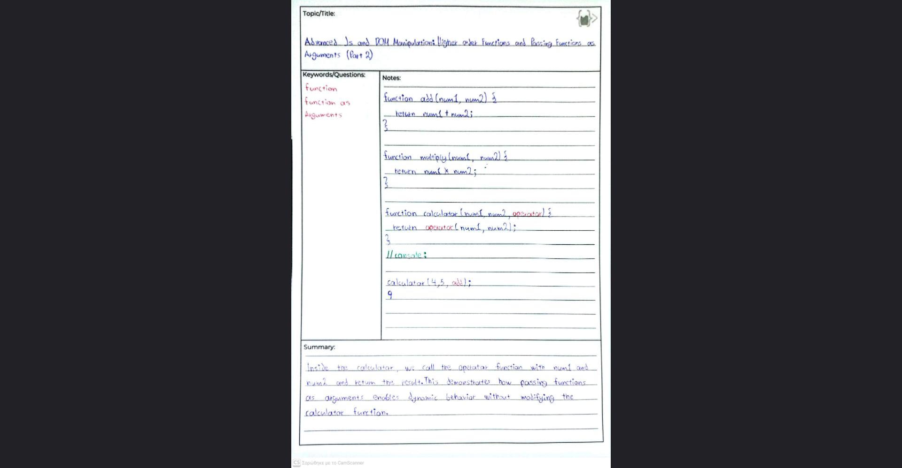
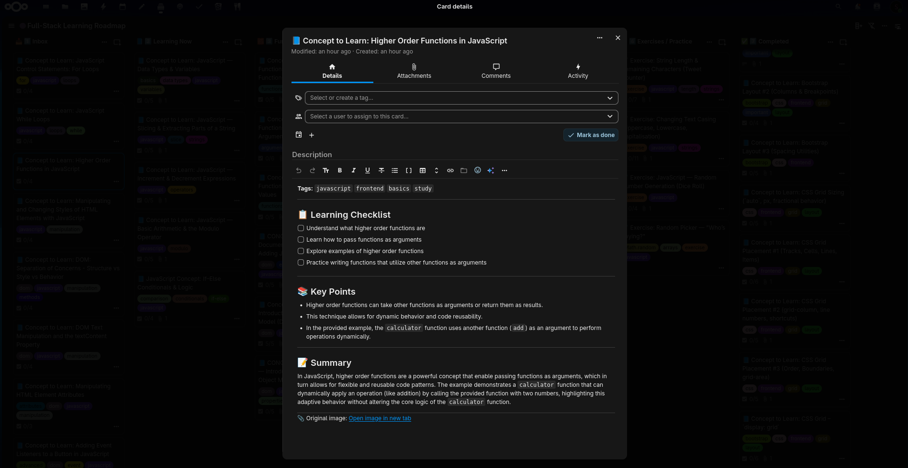
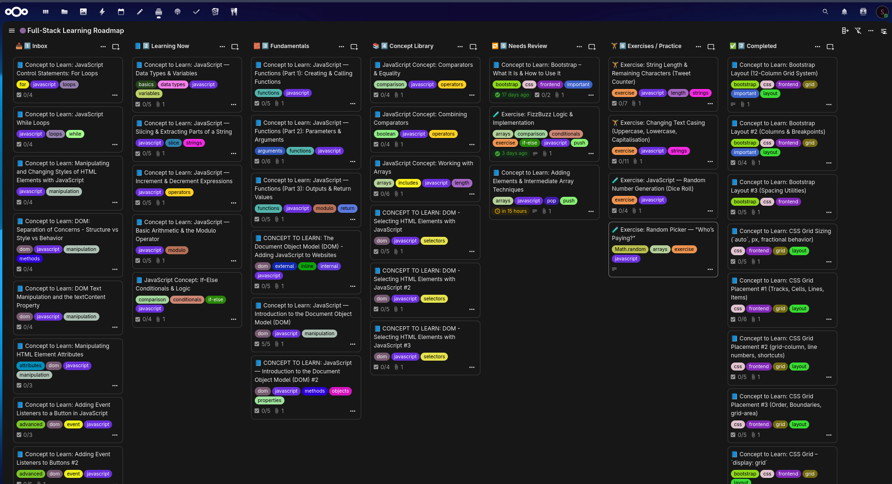
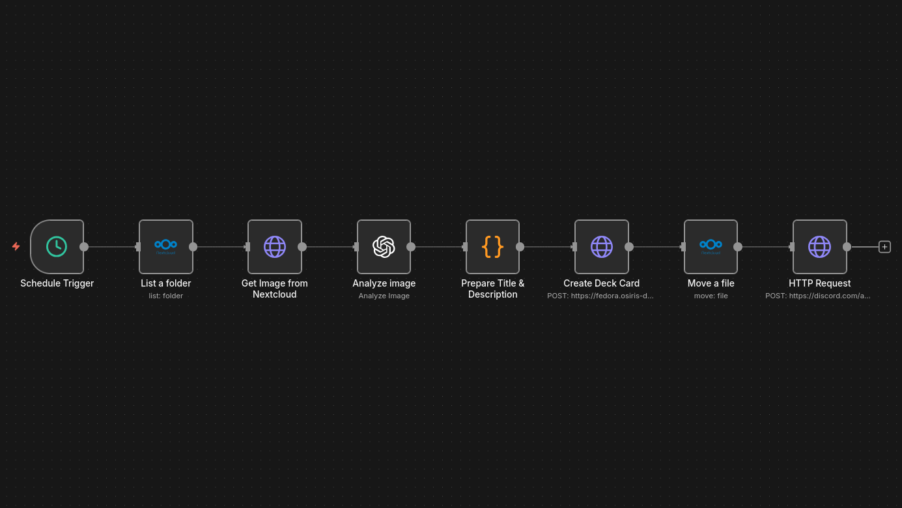

# 📝 AI-Powered Learning Notes Automation

> Automatically transform handwritten notes into structured, searchable digital cards

An n8n workflow that converts photos of handwritten study notes into beautifully formatted Nextcloud Deck cards using OpenAI Vision API. Built to solve a real problem: maintaining organized learning notes while working full-time.

[](https://n8n.io)
[](https://openai.com)
[](https://nextcloud.com)

---

## 🎯 The Problem

As a self-taught web developer studying while working full-time, I take extensive handwritten notes during learning sessions. The manual process was:

1. 📸 Take photo of notes
2. 💬 Upload to ChatGPT
3. ⏳ Wait for AI to rewrite
4. 📋 Create Nextcloud Deck card manually
5. ✍️ Copy-paste text, add tags, attach image

**Time per note:** ~10 minutes  
**Notes per week:** 15-20  
**Time wasted weekly:** 2.5-3 hours

This workflow eliminates **90% of manual work**.

---

## ✨ The Solution

A fully automated n8n workflow that:

- 🔍 Monitors a Nextcloud "Inbox" folder every minute
- 📥 Automatically processes new images
- 🤖 Uses OpenAI Vision API to extract and reformat text
- 📝 Creates structured Deck cards with consistent formatting
- 🔗 Includes link to original image for reference
- 💬 Sends Discord notification when complete

**New time per note:** ~30 seconds (just to add tags)  
**Time saved:** 9 minutes per note → 3 hours per week

---

## 🎬 How It Works

### Before: Manual Process

*Raw handwritten note about CSS Grid*

### After: Automated Result

*Automatically generated, formatted, and organized*

### My Nextcloud Deck Board

*200+ organized learning cards across different topics*

---

## 🔄 Workflow Steps



### 1. **Schedule Trigger**
Checks inbox folder every 60 seconds for new images

### 2. **List Folder**
Scans Nextcloud `/My notes/Inbox/` directory

### 3. **Get Image**
Retrieves image from Nextcloud via WebDAV

### 4. **Analyze Image** (OpenAI Vision)
- Extracts handwritten or printed text
- Translates to English (handles Greek notes)
- Cleans grammar and structure
- Formats using custom Markdown template

### 5. **Prepare Title & Description**
JavaScript code node that:
- Extracts title from AI response
- Parses suggested tags
- Formats description
- Adds link to original image

### 6. **Create Deck Card**
Posts formatted card to Nextcloud Deck via API

### 7. **Move File**
Relocates image from Inbox to main notes folder

### 8. **Discord Notification**
Sends confirmation message via webhook

---

## 📋 Card Template

The AI rewrites notes using this consistent structure:

```markdown
# 📘 Concept to Learn: [Topic Title]

**Tags:** `javascript` `frontend` `css` `study`

---

### 📋 Learning Checklist
- [ ] Understand what display: grid does
- [ ] Learn grid-template-columns
- [ ] Learn grid-template-rows
- [ ] Understand the fr (fractional unit)
- [ ] Review the example code

---

### 🎯 Key Points

**What is CSS Grid?**
- A layout system designed for two-dimensional layouts (rows + columns)
- Excellent for complex layouts that Flexbox alone struggles with

**Example (from your notes)**
[Code examples from the note]

---

### 📝 Summary
CSS Grid is ideal for layouts involving both rows and columns. It simplifies 
the creation of complex, multi-dimensional layouts, making complex designs 
easier than with Flexbox alone.

---

🔗 Original image: [Open image in new tab](https://nextcloud.../image.jpg)
```

---

## 🛠️ Technologies Used

- **n8n** - Workflow automation platform (self-hosted)
- **OpenAI Vision API (GPT-4o)** - Image analysis and text extraction
- **Nextcloud** - Self-hosted file storage
- **Nextcloud Deck** - Kanban-style task management
- **Discord Webhooks** - Status notifications
- **Linux + Docker** - Infrastructure

---

## 📊 Real-World Impact

Since implementing this system (November 2024):

- ✅ **150+ notes processed** automatically
- ✅ **~25 hours saved** (9 min × 150 notes)
- ✅ **Zero manual formatting** required
- ✅ **Consistent structure** across all notes
- ✅ **Instant searchability** via tags
- ✅ **Never lose context** - original image always linked

---

## 🚀 Setup & Installation

### Prerequisites

- Self-hosted n8n instance
- Nextcloud with Deck app
- OpenAI API key
- Discord webhook URL (optional)

### Installation Steps

1. **Import workflow**
   ```bash
   # Import workflow.json into your n8n instance
   ```

2. **Configure credentials**
   - Nextcloud WebDAV credentials
   - OpenAI API key
   - Discord webhook URL

3. **Update configuration**
   Edit the JavaScript node to match your setup:
   ```javascript
   const baseUrl = "https://YOUR-NEXTCLOUD-INSTANCE";
   const username = "YOUR-NEXTCLOUD-USERNAME";
   ```

4. **Activate workflow**
   Enable the schedule trigger in n8n

5. **Test it!**
   - Upload an image to `/My notes/Inbox/`
   - Wait 60 seconds
   - Check your Nextcloud Deck for the new card

---

## 🎓 What I Learned

Building this automation taught me:

- **API Integration:** Working with REST APIs (Nextcloud, OpenAI, Discord)
- **Workflow Design:** Breaking complex processes into discrete steps
- **Error Handling:** Managing failures in automated systems
- **Data Transformation:** Parsing and formatting AI responses
- **Self-Hosting:** Running production workflows on personal infrastructure
- **Problem-Solving:** Automating real-world pain points

---

## 🔮 Future Improvements

- [ ] Automatic tag application via Nextcloud Deck API
- [ ] Support for multiple note formats (PDFs, text files)
- [ ] Automatic categorization based on content
- [ ] Integration with spaced repetition system
- [ ] Generate Anki flashcards from notes
- [ ] Multi-language support improvements

---

## 📄 License

MIT License - Feel free to adapt for your own learning workflow!

---

## 👤 Author

**Charalampos Panagopoulos**  
Aspiring Full-Stack Web Developer  
Passionate about automation, self-hosting, and building tools that improve everyday life.

🔗 [Portfolio](https://c-panagopoulos.github.io/Personal-Website/)  
🔗 [GitHub](https://github.com/c-panagopoulos)  
🔗 [LinkedIn](https://linkedin.com/in/c-panagopoulos)

---

## 🙏 Acknowledgments

- Built with [n8n](https://n8n.io) - the open-source workflow automation tool
- Powered by [OpenAI GPT-4o Vision](https://openai.com)
- Organized with [Nextcloud Deck](https://apps.nextcloud.com/apps/deck)

---

**⭐ If you find this useful, consider starring the repo!**
